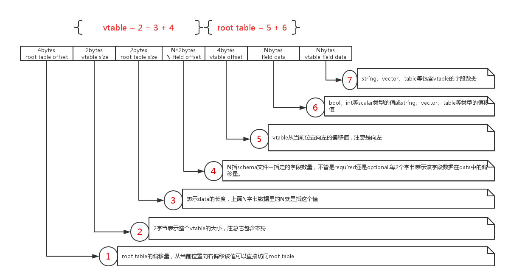
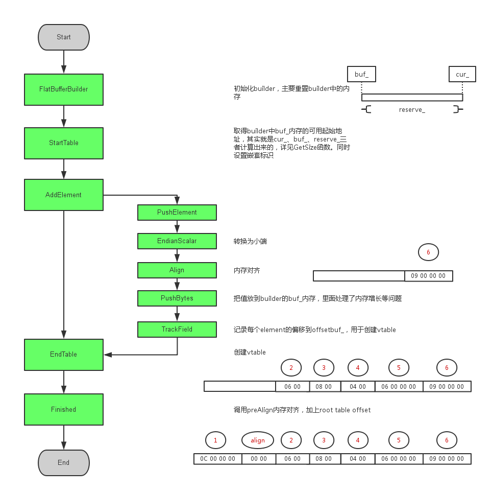

#### flatbuffers的原理

flatbuffers与protobuf的最大区别，就是protobuf需要序列化与反序列化，而flatbuffers不用。这
里以C++为例，简单说说flatbuffers如何达到无需序列化。例如，下面的一个结构体
```cpp
struct Monster
{
  unsigned short mana;
  unsigned short hp;
};
```
在不考虑内存对齐和大小端情况下，mana占2byte，hp占2byte，一个结构体中的各个变量在内存中是连续
的。因此，在C++中，把整个结构体直接发送出去是常有的事。
```cpp
struct Monoster monster;
monster.mana = 1;
monster.hp = 1;
::write(fd,&monster,sizeof(monster))
```
这其实就达到了无需序列化的目的。但做业务的时候，要考虑内存对齐。这也好办，C++可以轻松指定对齐。
```cpp
#pragma pack(push, 1)
struct Monster
{
  unsigned short mana;
  unsigned short hp;
};
#pragma pack(pop)
```
接下来，我们还会发现，我们需要的不仅仅是int这种基础类型数据，还会有数组、字符串等
```cpp
#pragma pack(push, 1)
struct Monster
{
  unsigned short mana;
  unsigned short hp;
  char *name;
};
#pragma pack(pop)
```
上面的name是一个指针。如果直接把整个结构体发送出去那肯定是没法把名字发出去了。但是我们也可以把
C++这一套指针的逻辑拿来用。依然把这个name指针发出去，但是这个指针不再是指向内存地址，而是指向
我们发出去的所有数据的地址，不就可以了么。
```cpp
struct Monoster monster;
monster.mana = 1;  // 2byte
monster.hp   = 1;  // 2byte
monster.name = 10; // a 64bit pointer,8byte

const char *name_data = "monster";

::write(fd,&monster,sizeof(monster))
::write(fd,name_data,strlen(name_data))
```
对方收到的数据的时候，如果是基础类型，那么直接就取值，如果是字符串，那么从第10byte开始读取，就
可以读取到真正的名字。数组、联合体、自定义结构体之类的数据类型也是这样处理。我们看下
monster_test.fbs产生的C++文件：
```cpp

struct Monster FLATBUFFERS_FINAL_CLASS : private flatbuffers::Table {
  typedef MonsterT NativeTableType;
  static const flatbuffers::TypeTable *MiniReflectTypeTable() {
    return MonsterTypeTable();
  }
  enum FlatBuffersVTableOffset FLATBUFFERS_VTABLE_UNDERLYING_TYPE {
    VT_POS = 4,
    VT_MANA = 6,
    VT_HP = 8,
    VT_NAME = 10,
    VT_INVENTORY = 14,
    VT_COLOR = 16,
    VT_WEAPONS = 18,
    VT_EQUIPPED_TYPE = 20,
    VT_EQUIPPED = 22,
    VT_PATH = 24
  };
  const Vec3 *pos() const {
    return GetStruct<const Vec3 *>(VT_POS);
  }
  Vec3 *mutable_pos() {
    return GetStruct<Vec3 *>(VT_POS);
  }
  int16_t mana() const {
    return GetField<int16_t>(VT_MANA, 150);
  }
  bool mutate_mana(int16_t _mana) {
    return SetField<int16_t>(VT_MANA, _mana, 150);
  }
  int16_t hp() const {
    return GetField<int16_t>(VT_HP, 100);
  }
  bool mutate_hp(int16_t _hp) {
    return SetField<int16_t>(VT_HP, _hp, 100);
  }
```
结构体中没有了成员变量，取而代之的是各个变量的偏移量，即VT_XXX。读写变量都是通过依稀来实现的。

上面只是一个简单的例子，说明了flatbuffers的原理。但flatbuffers做的远远比这个多，比这个复杂。
毕竟还需要检验数据准确性。不同平台、不同语言的内存对齐都要统一，各个实现就会不一样。但这也说明一
个问题，flatbuffers在各个语言的实现上效率是不一样的。flatbuffers原本也只是C++实现，然后扩展
到其他语言的，如果是静态语言，都还好。毕竟编译后各个变量映射在内存中，不需要考虑对齐什么的，编译
器都帮你做了。如果是动态语言，那么和直接从二进制流中读取数据没什么太大差别，比如lua的实现。

而我这里的实现，是用反射来做的，希望达到pbc那种不用生成各个类文件(monster.lua这种)。那么直接
就和protobuf没什么区别了，无非就是反射解析数据的算法和protobuf的反序列化的算法谁快而已。由于
protobuf有压缩，会慢一点点。

#### flatbuffers类图


#### schema文件与类的对应关系


#### 常见变量
* uoffset_t sofffset_t voffset_t定义在base.h

```cpp
/// @cond FLATBUFFERS_INTERNAL
// Our default offset / size type, 32bit on purpose on 64bit systems.
// Also, using a consistent offset type maintains compatibility of serialized
// offset values between 32bit and 64bit systems.
typedef uint32_t uoffset_t;

// Signed offsets for references that can go in both directions.
typedef int32_t soffset_t;

// Offset/index used in v-tables, can be changed to uint8_t in
// format forks to save a bit of space if desired.
typedef uint16_t voffset_t;

typedef uintmax_t largest_scalar_t;

// In 32bits, this evaluates to 2GB - 1
#define FLATBUFFERS_MAX_BUFFER_SIZE ((1ULL << (sizeof(soffset_t) * 8 - 1)) - 1)

// We support aligning the contents of buffers up to this size.
#define FLATBUFFERS_MAX_ALIGNMENT 16
```

uoffset_t通常用来表示某个变量相对于buf_开始的位置，见：
```cpp
// vector_downward的成员函数size
// reserved_、cur_、buf_的关系见下面的图
  uoffset_t size() const {
    return static_cast<uoffset_t>(reserved_ - (cur_ - buf_));
  }
```
voffset_t通常表示某个变量在vtable中的偏移量，占2byte，所以生成的文件里，每个变量是相差2。第
一个变量从4开始是因vtable会写入table_object_size和max_voffset_，占4字段。

```cpp
  enum FlatBuffersVTableOffset FLATBUFFERS_VTABLE_UNDERLYING_TYPE {
    VT_POS = 4,
    VT_MANA = 6,
    VT_HP = 8,
    VT_NAME = 10,
    VT_INVENTORY = 14,
    VT_COLOR = 16,
    VT_WEAPONS = 18,
    VT_EQUIPPED_TYPE = 20,
    VT_EQUIPPED = 22,
    VT_PATH = 24
  };
```

* vtable
* root table

#### flatbuffers的内存模型


root table offset类型为uoffset_t，即uint32_t

#### flatbuffers的创建过程

先写一个极其简单的schema文件test_cpp.fbs
```flatbuffers
table simple_table
{
    x:int;
}
```

生成C++头文件test_cpp_generated.h
```shell
flact --cpp test_cpp.fbs
```

写个简单的测试程序test_cpp.cpp
```cpp
#include <iostream>

#include <flatbuffers/util.h>
#include "test_cpp_generated.h"

int main()
{
    const char *file = "test_cpp.bin";
    flatbuffers::FlatBufferBuilder builder;

    auto st = Createsimple_table( builder,9 );
    builder.Finish( st );

    const char *bufferpointer =
        reinterpret_cast<const char *>(builder.GetBufferPointer());
    uint16_t sz = builder.GetSize();

    flatbuffers::SaveFile( file,bufferpointer,sz,true );

    std::cout << "encode finish,size is " << sz << std::endl;

    std::string buff;

    if ( !flatbuffers::LoadFile( file,true,&buff ) ) return -1;

    const simple_table *_st = flatbuffers::GetRoot<simple_table>(
        reinterpret_cast<const uint8_t *>(buff.c_str()) );

    std::cout << _st->x() << std::endl;
    return 0;
}
```

编译运行并生成二进制文件
```shell
g++ -std=c++11 -o test_cpp test_cpp.cpp -lflatbuffe
./test_cpp
```

查看生成的二进制文件，内容为
```shell
0c00 0000 0000 0600 0800 0400 0600 0000 0900 0000
```

分析创建流程


vector_downward
```cpp
// This is a minimal replication of std::vector<uint8_t> functionality,
// except growing from higher to lower addresses. i.e push_back() inserts data
// in the lowest address in the vector.
// Since this vector leaves the lower part unused, we support a "scratch-pad"
// that can be stored there for temporary data, to share the allocated space.
// Essentially, this supports 2 std::vectors in a single buffer.
class vector_downward {
    size_t reserved_;
  uint8_t *buf_;
  uint8_t *cur_;  // Points at location between empty (below) and used (above).
  uint8_t *scratch_;  // Points to the end of the scratchpad in use.
};
```

创建flatbuffers的时候，数据缓存在flatbufferbuilder的buf_变量中，就是下面这个vector。由于faltbuffers是先填允高地址数据，所以高地址用来存数据，低地址用来存临时数据(scratch_变量)。比如填允一个table时，数据直接写入cur_高地址，vtable则写入低地址(见AddElement中调用TrackField)。当这个table填允完成时，把vtable写回高地址，低地址临时数据被清空(EndTable里ClearOffsets())。

FlatBufferBuilder
```cpp
/// @addtogroup flatbuffers_cpp_api
/// @{
/// @class FlatBufferBuilder
/// @brief Helper class to hold data needed in creation of a FlatBuffer.
/// To serialize data, you typically call one of the `Create*()` functions in
/// the generated code, which in turn call a sequence of `StartTable`/
/// `PushElement`/`AddElement`/`EndTable`, or the builtin `CreateString`/
/// `CreateVector` functions. Do this is depth-first order to build up a tree to
/// the root. `Finish()` wraps up the buffer ready for transport.
class FlatBufferBuilder {
  vector_downward buf_;

  // Accumulating offsets of table members while it is being built.
  // We store these in the scratch pad of buf_, after the vtable offsets.
  uoffset_t num_field_loc;
  // Track how much of the vtable is in use, so we can output the most compact
  // possible vtable.
  voffset_t max_voffset_;

  // Ensure objects are not nested.
  bool nested;

  // Ensure the buffer is finished before it is being accessed.
  bool finished;

  size_t minalign_;

  bool force_defaults_;  // Serialize values equal to their defaults anyway.

  bool dedup_vtables_;
};
```
FlatBufferBuilder是flatbuffers最核心的逻辑，它管理了内存对齐、寻址等。


根据代码分析vtable的创建(new version:flatbuffers 1.11.0)

根据版本日志vtable结构应该是在1.8.0版本修改的
> Vtable trimming in all language implementations: can reduce binary size 10-20%!
在新版本中，AddElement函数会记录每个字段的voffset和uoffset
```cpp
  // When writing fields, we track where they are, so we can create correct
  // vtables later.
  void TrackField(voffset_t field, uoffset_t off) {
    FieldLoc fl = { off, field };
    buf_.scratch_push_small(fl);
    num_field_loc++;
    max_voffset_ = (std::max)(max_voffset_, field);
  }
```
写入vtable的时候，是根据这些数据来写的。
不像旧版本一样，把所有字段都放到vtable里，即使那个字段是optional并且当次并没有发送数据

下面的注释，英文是原有注释，中文是我加上去的注释
```cpp

  // This finishes one serialized object by generating the vtable if it's a
  // table, comparing it against existing vtables, and writing the
  // resulting vtable offset.
  // @start：整个tabel开始的位置，即StartTable的返回值
  uoffset_t EndTable(uoffset_t start) {

    // If you get this assert, a corresponding StartTable wasn't called.
    FLATBUFFERS_ASSERT(nested);

    // Write the vtable offset, which is the start of any Table.
    // We fill it's value later.
    auto vtableoffsetloc = PushElement<soffset_t>(0);

    // Write a vtable, which consists entirely of voffset_t elements.
    // It starts with the number of offsets, followed by a type id, followed
    // by the offsets themselves. In reverse:
    // Include space for the last offset and ensure empty tables have a
    // minimum size.
    // 字段在vtable中的地址(对应生成的cpp文件中的VT_XXX)是从4开始的
    // 4表示 vtable_size + table_size
    // 因此整个vtable的大小 = 4 + max_offset_ + 2
    // 2表示最大的那个字段自己要占2字段，即下面的sizeof(voffset_t)
    max_voffset_ =
        (std::max)(static_cast<voffset_t>(max_voffset_ + sizeof(voffset_t)),
                   FieldIndexToOffset(0));

    // 预分配vtable内存，由于内存是从高到低的，buf_.data取的是cur_的地址，
    // 所以下面写数据时用buf_.data()来取地址的，都是写到这个预分配的内存里
    buf_.fill_big(max_voffset_);
    auto table_object_size = vtableoffsetloc - start;

    // Vtable use 16bit offsets.
    // 整个table的大小(即各种字段的数据加超来，包括vtableoffsetloc本身，大小不超过16bit)
    FLATBUFFERS_ASSERT(table_object_size < 0x10000);

    // 写入vtable的大小，这里加了sizeof(voffset_t)，故在max_voffset后面
    WriteScalar<voffset_t>(buf_.data() + sizeof(voffset_t),
                           static_cast<voffset_t>(table_object_size));

    // 写入最大的字段偏移量，GetOptionalFieldOffset这函数就是和这个值对比，判断该字段是否存在
    WriteScalar<voffset_t>(buf_.data(), max_voffset_);

    // Write the offsets into the table
    // 写入各个字段的位置偏移。这里buf_.data() + field_location->id来取地址，
    // id即voffset所以,各个字段是按顺序的.
    // 大于max_voffset_的字段，它们的信息不包含在vtable里了。
    // 小于的，他们的位置仍然像旧版本一样值为0
    for (auto it = buf_.scratch_end() - num_field_loc * sizeof(FieldLoc);
         it < buf_.scratch_end(); it += sizeof(FieldLoc)) {
      auto field_location = reinterpret_cast<FieldLoc *>(it);

      // 计算出字段内容相对于当前vtable的偏移
      auto pos = static_cast<voffset_t>(vtableoffsetloc - field_location->off);

      // If this asserts, it means you've set a field twice.
      FLATBUFFERS_ASSERT(
          !ReadScalar<voffset_t>(buf_.data() + field_location->id));
      WriteScalar<voffset_t>(buf_.data() + field_location->id, pos);
    }
    ClearOffsets();

    auto vt1 = reinterpret_cast<voffset_t *>(buf_.data());

    // 读取buf_data处的一个voffset_t值，应该就是上面写入的max_voffset_
    // fill_big之后就没再分配过内存了，它的大小刚好是vtable的大小(不包含vtableoffsetloc)
    auto vt1_size = ReadScalar<voffset_t>(vt1);
    auto vt_use = GetSize();

    // See if we already have generated a vtable with this exact same
    // layout before. If so, make it point to the old one, remove this one.

    // vtable去重。我想不到这是什么使用场景，一般来说，很少会有相同的vtable的
    // 假如你发一个数组，数组里每个元素的是table，而且刚好发送的字段是一样的(内容可以不一样，
    // 因为存的是对于vtable的偏移量)的时候才会有重复
    // 但是这个代价有点大吧
    if (dedup_vtables_) {
      for (auto it = buf_.scratch_data(); it < buf_.scratch_end();
           it += sizeof(uoffset_t)) {
        auto vt_offset_ptr = reinterpret_cast<uoffset_t *>(it);
        auto vt2 = reinterpret_cast<voffset_t *>(buf_.data_at(*vt_offset_ptr));
        auto vt2_size = *vt2;
        if (vt1_size != vt2_size || 0 != memcmp(vt2, vt1, vt1_size)) continue;
        vt_use = *vt_offset_ptr;
        buf_.pop(GetSize() - vtableoffsetloc);
        break;
      }
    }

    // If this is a new vtable, remember it.
    if (vt_use == GetSize()) { buf_.scratch_push_small(vt_use); }

    // Fill the vtable offset we created above.
    // The offset points from the beginning of the object to where the
    // vtable is stored.
    // Offsets default direction is downward in memory for future format
    // flexibility (storing all vtables at the start of the file).
    // 记录vtable相对当前地址的偏移量，因为上面去重的原因，vtable和table并不总是连续的
    // 这里记录一个相对位置。因为vtable可能在前也可能在后，用的soffset_t
    // 可参考GetVTable的用法
    WriteScalar(buf_.data_at(vtableoffsetloc),
                static_cast<soffset_t>(vt_use) -
                    static_cast<soffset_t>(vtableoffsetloc));

    nested = false;
    return vtableoffsetloc;
  }
```

#### 数组
把上面的schema文件稍微修改一下：
```flatbuffers
table simple_table
{
    x:[bool];
}
```
当内容为
```json
{x:[true]}
{x:[true,true]}
```
二进制内容分别为:
```shell
0c00 0000 0000 0600 0800 0400 0600 0000 0400 0000 0100 0000 0100 0000

0c00 0000 0000 0600 0800 0400 0600 0000 0400 0000 0200 0000 0101 0000
```
可以看到，其内容与上面例子不同的是0200 0000 0101 0000，其中0200 0000是一个uoffset_t,
即一个uint32_t.而0101 0000则是bool(uint8_t)按4bytes对齐后的结果。

分析创建数组的函数
```cpp
  uoffset_t EndVector(size_t len) {
    assert(nested);  // Hit if no corresponding StartVector.
    nested = false;
    return PushElement(static_cast<uoffset_t>(len));
  }

  void StartVector(size_t len, size_t elemsize) {
    NotNested();
    nested = true;
    PreAlign<uoffset_t>(len * elemsize);
    PreAlign(len * elemsize, elemsize);  // Just in case elemsize > uoffset_t.
  }
```
PreAlign会先按uoffset_t对齐，这样如果数组元素(内存大小，不是值)小于等于uoffset_t时，就OK了，如bool类型。
但如果是一个自定义的元素(比如一个比较大的table)，PreAlign(len * elemsize, elemsize)就会重新再对齐一次。

从上面的例子可以看出，如果事先不知道数组的长度，创建数组并不容易，因为无法对齐。对于lua中的table，如果想
当作数组使用，就会有这个问题。

#### 联合体union

先将一个包含union的简单schema文件以c++编译出来：
```flatbuffers
table simple_table { x:[bool]; }

table simple_table2 { y:[bool]; }

union any { simple_table,simple_table2 }

table simple { x:any; }
```
```cpp
enum any {
  any_NONE = 0,
  any_simple_table = 1,
  any_simple_table2 = 2,
  any_MIN = any_NONE,
  any_MAX = any_simple_table2
};

inline const char **EnumNamesany() {
  static const char *names[] = { "NONE", "simple_table", "simple_table2", nullptr };
  return names;
}

inline flatbuffers::Offset<simple> Createsimple(flatbuffers::FlatBufferBuilder &_fbb,
    any x_type = any_NONE,
    flatbuffers::Offset<void> x = 0) {
  simpleBuilder builder_(_fbb);
  builder_.add_x(x);
  builder_.add_x_type(x_type);
  return builder_.Finish();
}

inline bool Verifyany(flatbuffers::Verifier &verifier, const void *union_obj, any type) {
  switch (type) {
    case any_NONE: return true;
    case any_simple_table: return verifier.VerifyTable(reinterpret_cast<const simple_table *>(union_obj));
    case any_simple_table2: return verifier.VerifyTable(reinterpret_cast<const simple_table2 *>(union_obj));
    default: return false;
  }
}
```
可以看到，创建一个包含union必须要传入类型（add_x_type）。最终在内存中也会包含一个类型字段。而对于这个字段的产生，是
flatbuffers在编译，自动加了一个虚拟的字段，见Parser::ParseField::idl_parser.cpp::592
```cpp
  ...
  if (type.base_type == BASE_TYPE_UNION) {
    // For union fields, add a second auto-generated field to hold the type,
    // with a special suffix.
    ECHECK(AddField(struct_def, name + UnionTypeFieldSuffix(),
                    type.enum_def->underlying_type, &typefield));
  }
  ...
```
对应的用法见reflection.h的GetUnionType函数。这些都是1.4.0版本后的函数，1.3.0查不到。
创建一个uion的时候，一定要指定这个字段。

#### 结束语
上面只是分析一个很简单的例子，其他复杂的内容如内存对齐、vtable共享、table嵌套、数组等一
下子也说不清楚。如果你感兴趣，就自己去研究源码，下面的参考链接里有分析。下面还有几个注意点：
* 内存从高往低写，这是因为flatbuffers的结构设计如此，必须先创建子对象(Do this is depth-first order to build up a tree to the root)
* 小端存储，用WriteScalar、ReadScalar就不会有太大问题
* 存在内存对齐，这个可能会干扰你分析问题

#### 其他参考
https://github.com/mzaks/FlatBuffersSwift/wiki/FlatBuffers-Explained  
https://github.com/google/flatbuffers/blob/master/docs/source/Internals.md  
