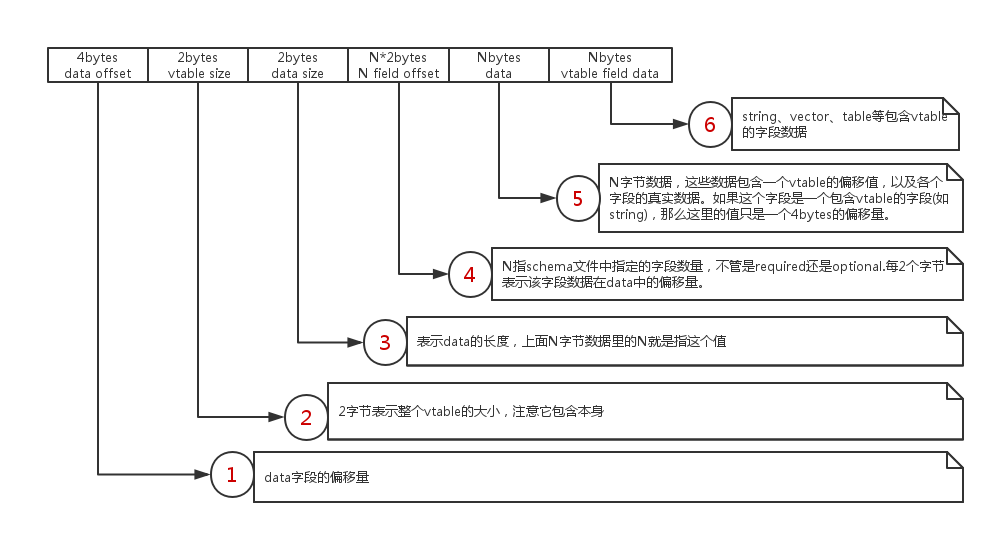
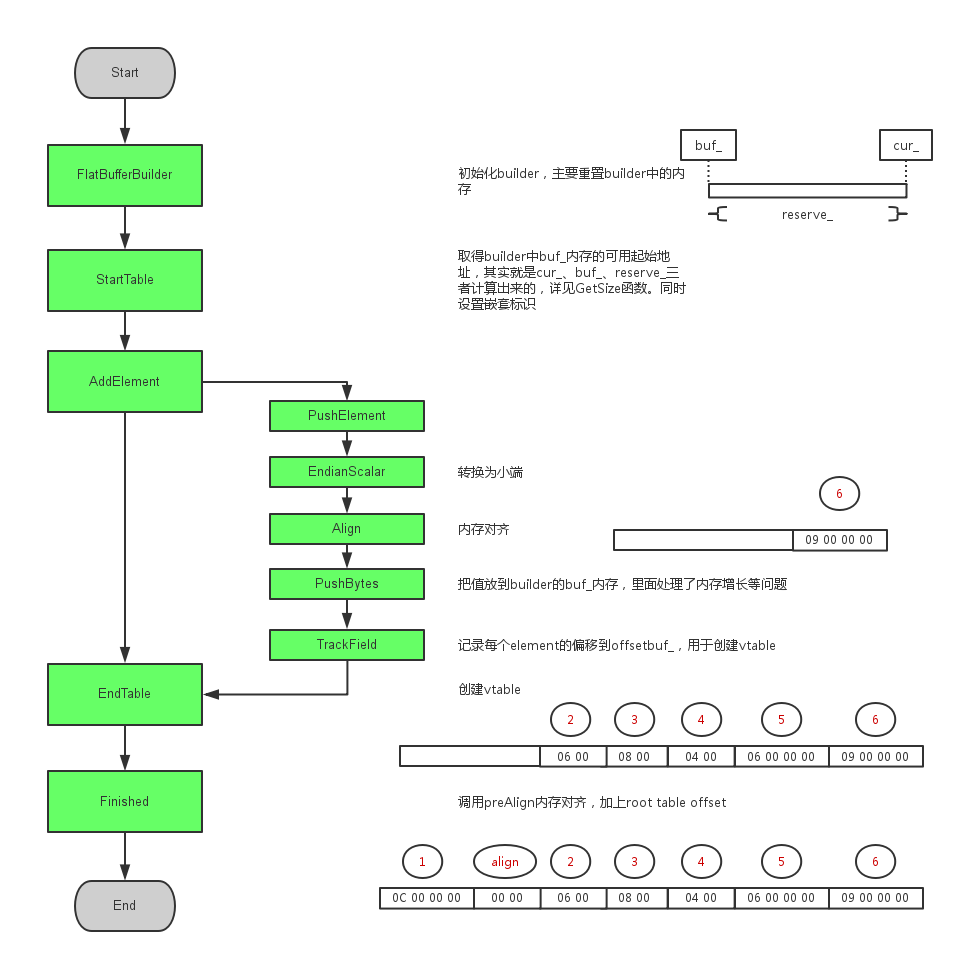

#### flatbuffers类图


#### schema文件与类的对应关系


#### flatbuffers的内存模型


#### flatbuffers的创建过程

先写一个极其简单的schema文件test_cpp.fbs
```flatbuffers
table simple_table
{
    x:int;
}
```

生成C++头文件test_cpp_generated.h
```shell
flact --cpp test_cpp.fbs
```

写个简单的测试程序test_cpp.cpp
```cpp
#include <iostream>

#include <flatbuffers/util.h>
#include "test_cpp_generated.h"

int main()
{
    const char *file = "test_cpp.bin";
    flatbuffers::FlatBufferBuilder builder;

    auto st = Createsimple_table( builder,9 );
    builder.Finish( st );

    const char *bufferpointer =
        reinterpret_cast<const char *>(builder.GetBufferPointer());
    uint16_t sz = builder.GetSize();

    flatbuffers::SaveFile( file,bufferpointer,sz,true );

    std::cout << "encode finish,size is " << sz << std::endl;

    std::string buff;

    if ( !flatbuffers::LoadFile( file,true,&buff ) ) return -1;

    const simple_table *_st = flatbuffers::GetRoot<simple_table>(
        reinterpret_cast<const uint8_t *>(buff.c_str()) );

    std::cout << _st->x() << std::endl;
    return 0;
}
```

编译运行并生成二进制文件
```shell
g++ -std=c++11 -o test_cpp test_cpp.cpp -lflatbuffe
./test_cpp
```

查看生成的二进制文件，内容为
```shell
0c00 0000 0000 0600 0800 0400 0600 0000 0900 0000
```

分析创建流程


根据代码分析vtable的创建
```cpp
  // 传入的是元素开始的偏移量及元素个数
  uoffset_t EndTable(uoffset_t start, voffset_t numfields) {
    // 检测是否嵌套(table都要求是嵌套的)
    assert(nested);
    // 写入root table中vtable的偏移值。因为现在不知道vtable的大小，先写个0占位
    auto vtableoffsetloc = PushElement<soffset_t>(0);
    // 写入各个字段(从当前位置到root table中对应字段)的偏移值，这里只是全部填充0占位
    buf_.fill(numfields * sizeof(voffset_t));
    auto table_object_size = vtableoffsetloc - start;
    assert(table_object_size < 0x10000);  // Vtable use 16bit offsets.
    // 写入root table的大小
    PushElement<voffset_t>(static_cast<voffset_t>(table_object_size));
    // 写入vtable的大小，固定为4bytes + numfields*2bytes,
    // 4bytes为本身加上root table的大小
    PushElement<voffset_t>(FieldIndexToOffset(numfields));
    // Write the offsets into the table
    for (auto field_location = offsetbuf_.begin();
              field_location != offsetbuf_.end();
            ++field_location) {
      auto pos = static_cast<voffset_t>(vtableoffsetloc - field_location->off);
      // If this asserts, it means you've set a field twice.
      assert(!ReadScalar<voffset_t>(buf_.data() + field_location->id));
      // 这里开始填充各个字段(从当前位置到root table中对应字段)的偏移值
      WriteScalar<voffset_t>(buf_.data() + field_location->id, pos);
    }
    offsetbuf_.clear();
    auto vt1 = reinterpret_cast<voffset_t *>(buf_.data());
    auto vt1_size = ReadScalar<voffset_t>(vt1);
    auto vt_use = GetSize();
    // See if we already have generated a vtable with this exact same
    // layout before. If so, make it point to the old one, remove this one.
    for (auto it = vtables_.begin(); it != vtables_.end(); ++it) {
      auto vt2 = reinterpret_cast<voffset_t *>(buf_.data_at(*it));
      auto vt2_size = *vt2;
      if (vt1_size != vt2_size || memcmp(vt2, vt1, vt1_size)) continue;
      vt_use = *it;
      buf_.pop(GetSize() - vtableoffsetloc);
      break;
    }
    // If this is a new vtable, remember it.
    if (vt_use == GetSize()) {
      vtables_.push_back(vt_use);
    }
    // 填充root table中vtable的偏移值，注意这个值是当前位置向左
    WriteScalar(buf_.data_at(vtableoffsetloc),
                static_cast<soffset_t>(vt_use) -
                  static_cast<soffset_t>(vtableoffsetloc));

    nested = false;
    return vtableoffsetloc;
  }
```

#### 结束语
上面只是分析一个很简单的例子，其他复杂的内容如内存对齐、vtable共享、table嵌套、数组等一
下子也说不清楚。如果你感兴趣，就自己去研究源码。下面还有几个注意点：
* 内存从高往低写，这是因为flatbuffers的结构设计如此，必须先创建子对象(Do this is depth-first order to build up a tree to the root)
* 小端存储，你用WriteScalar、ReadScalar就不会有太大问题
* 存在内存对齐，这个可能会干扰你分析问题

#### 其他参考
https://github.com/mzaks/FlatBuffersSwift/wiki/FlatBuffers-Explained  
https://github.com/google/flatbuffers/blob/master/docs/source/Internals.md  
